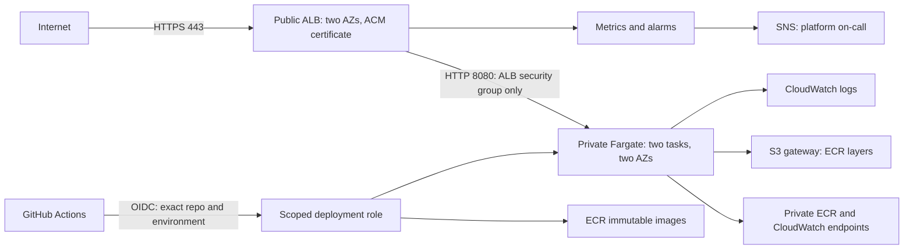

# Finzla assessment platform

A minimal Python service and AWS ECS Fargate platform built from the supplied Finzla Cloud & Platform Engineer assessment text. The attachment was a text export, not a PDF file; all requirements in that export were reviewed. Development is live at [finzla.kunlekush.name.ng](https://finzla.kunlekush.name.ng/health) in London; see [live deployment status](docs/deployment.md). Local evidence and outstanding checks from the initial assessment build are in [docs/validation.md](docs/validation.md).

## Application and local use

Python standard library only. `GET /health` returns HTTP 200 and `{"status":"ok"}`. `GET /version` returns `APP_VERSION` (baked Git commit) and `APP_ENV`. Unknown routes return 404. Logs are JSON on stdout. It has no credentials, secret inputs, or third-party runtime packages. This small HTTP server is suitable for the assessment; replace it with a hardened application server before handling fintech traffic.

```bash
python3 -m unittest discover -s tests -v
APP_ENV=development APP_VERSION=local python3 app/server.py
# In another terminal:
curl -fsS http://localhost:8080/health
curl -fsS http://localhost:8080/version

docker build --build-arg APP_VERSION=local -t finzla:local .
docker run --rm --read-only --cap-drop=ALL --security-opt=no-new-privileges \
  -e APP_ENV=development -p 127.0.0.1:8080:8080 finzla:local
```

The image installs available Alpine security updates and removes pip, bundled ensurepip wheels, and other site-packages because the service needs only the standard library. Rebuild with `--no-cache` when checking new distribution fixes; apk package versions can change between builds, so identify deployed artifacts by their resulting ECR digest. The container runs as UID 10001, uses a read-only filesystem in ECS, and has an internal health check. Binding to all interfaces is necessary inside the container; Bandit B104 is the explicitly excluded check. Network exposure is controlled outside the process.

## Architecture and request path



A diagram source is also in [docs/architecture.mmd](docs/architecture.mmd). DNS for the configured hostname points to the ALB. ACM terminates TLS with a TLS 1.2/1.3 policy. Port 80 is closed. The ALB forwards HTTP on 8080 to task ENIs; the task security group accepts only the ALB security group. Tasks have no public IP or internet default route. HTTPS egress is limited to interface endpoints and the S3 prefix list; the S3 endpoint policy allows only regional ECR layer downloads. Security group return traffic is stateful. An ALB spans public subnets with an Internet Gateway route. Endpoint networking spans both private subnets.

Fargate avoids host patching and Kubernetes control-plane complexity for one tiny service. EKS is a reasonable alternative for a larger Kubernetes estate, but introduces cost and operational work with little benefit here. TLS within the VPC, WAF, and request authentication are readiness improvements; there is no customer data in this service.

## Terraform and environment separation

`infra/` is one reusable root with separate development/production tfvars, VPC CIDRs, names, IAM roles, ECR repositories, log retention, and **state keys**. Prefer separate AWS accounts and state buckets for the two environments; never give the development role access to production. `desired_count=2` is normal; zero is allowed only for initial repository bootstrapping. Production ALB deletion protection is enabled. Terraform ignores service `task_definition` updates because the release pipeline owns that field; infrastructure changes remain Terraform-owned. When changing the task template, explicitly coordinate a new revision with the release process; editing Terraform alone does not move the live service to a new template.

Remote state uses a private, versioned, encrypted S3 bucket and native S3 `.tflock` locking (Terraform >=1.10). `bootstrap/` creates a bucket and development-only read/plan OIDC role. It is deliberately a separate operator-run root, not a CI auto-apply. Initial bootstrap uses local state; store it securely. After bucket creation, copy `bootstrap/backend.tf.example` to `bootstrap/backend.tf`, prepare a gitignored backend config using key `bootstrap/terraform.tfstate`, and run `terraform -chdir=bootstrap init -migrate-state -backend-config=YOUR_CONFIG` to migrate it into its own protected S3 key. State can contain sensitive values: do not commit or upload it as a public CI artifact. The plan role has read-only infrastructure discovery and development state read access, plus writes/deletes only to the development lock object. Its read APIs are account-wide where discovery requires them, so use a dedicated development account. It cannot apply infrastructure, pass IAM roles, or deploy workloads.

An operator uses a federated, time-limited provisioning role, with explicit permissions for the resource types in this repository, scoped names/ARNs and tags where AWS supports them, `iam:PassRole` limited to the ECS roles, and a permissions boundary/SCP for IAM creation. Do not use AdministratorAccess. The operator separately needs S3 list/get/put on the environment state and get/put/delete on its lock object; state deletion is unnecessary. The bootstrap role needs bucket configuration and scoped IAM role/policy creation, not unrestricted IAM. Infrastructure changes are reviewed and applied by that operator to the saved approved plan. This solution automates application releases, not privileged Terraform applies. S3 locks protect Terraform changes; GitHub environment concurrency serializes release workflows. Do not run manual service updates concurrently with a release.

## First deployment handoff (not executed)

1. Create the GitHub repository and replace the CODEOWNERS placeholders. Set required PR review, required `Validate pull request / validate` check, code owner review, no force pushes, no admin bypass, and restricted workflow modification. Fork PRs run validation only; an AWS-backed plan must be performed on a reviewed trusted branch. Same-repository PR plans require `terraform-plan` environment approval because PR Terraform can execute arbitrary code.
2. In each AWS account establish the GitHub OIDC provider (`https://token.actions.githubusercontent.com`, audience `sts.amazonaws.com`) through the organization's identity bootstrap. Create/validate an ACM certificate **in the ALB region**, and choose a hostname you control. OIDC providers are account-wide; this root accepts the existing provider ARN to avoid duplicate ownership.
3. Review and run `bootstrap/` with federated operator credentials and variables `region`, `state_bucket`, `oidc_provider_arn`, `plan_subject`. Use an exact `terraform-plan` environment subject. In the production account set `enable_plan_role=false` for a bucket-only bootstrap; the development plan role has no production access. No secret value is required in tfvars.
4. Copy `infra/environments/backend.hcl.example` to a gitignored `development.backend.hcl`. Set bucket/region/key. Export the six required `TF_VAR_*` values shown in the development tfvars comment. `image_uri` must be an ECR digest; for the empty-repository bootstrap use that repository's intended URI plus a placeholder 64-character digest **only with desired_count=0**.

```bash
terraform -chdir=infra init -backend-config=environments/development.backend.hcl
terraform -chdir=infra plan -var-file=environments/development.tfvars -var=desired_count=0 -out=bootstrap.tfplan
# After reviewing the plan, an authorized engineer can apply it in the future:
terraform -chdir=infra apply bootstrap.tfplan
```

5. Build and scan an initial image locally/CI, push to the Terraform output ECR repository using federated operator credentials, obtain its real SHA256 digest, and set `TF_VAR_image_uri` to `repository_url@sha256:...`. Plan/apply **again with `desired_count=0`** to register the real initial task revision. Because Terraform deliberately ignores the service task-definition field, explicitly start the service using the new output revision:

```bash
aws ecs update-service \
  --cluster "$(terraform -chdir=infra output -raw cluster_name)" \
  --service "$(terraform -chdir=infra output -raw service_name)" \
  --task-definition "$(terraform -chdir=infra output -raw initial_task_definition_arn)" \
  --desired-count 2
aws ecs wait services-stable \
  --cluster "$(terraform -chdir=infra output -raw cluster_name)" \
  --services "$(terraform -chdir=infra output -raw service_name)"
```

Then plan/apply with the normal Terraform count of two so configuration/state agree with the running capacity. Inspect the exact active revision and healthy ALB targets; stability alone can mask failed first startup. Point DNS (Route53 alias or your DNS provider) at `alb_dns_name`, and confirm TLS, `/health`, and the seeded `/version`. This establishes the first healthy release required for circuit breaker rollback. Do not enable automated releases while count is zero or the seed is unhealthy.
6. Confirm the SNS email subscription. Create GitHub environments `development`, `production`, and `terraform-plan`. Production must require independent reviewers, prevent self-review, forbid bypass, and permit deployments only from `main`. Apply equivalent reviewed plan protections for `terraform-plan`; permit same-repository PR refs there. GitHub plan availability for private-repository environment approvals depends on the organization's subscription; if unavailable, use an equivalent external approval gate before production.
7. Set deployment environment variables `AWS_REGION`, `DEPLOY_ROLE_ARN`, `ECR_REPOSITORY` (full registry/repository URL), `ECS_CLUSTER`, `ECS_SERVICE`, and `BASE_URL` (HTTPS hostname). For `terraform-plan`, set `PLAN_ROLE_ARN`, `STATE_BUCKET`, `AWS_REGION`, `CERTIFICATE_ARN`, `HOSTNAME`, `INITIAL_IMAGE_URI`, `OIDC_PROVIDER_ARN`, `DEPLOY_SUBJECT`, `ALERT_EMAIL`. The development tfvars region must agree with `AWS_REGION`; edit tfvars for a different region.
8. Configure `github_deploy_subject` from the **actual** GitHub token subject. Legacy format is `repo:OWNER/REPO:environment:production`; newer repositories may include immutable owner/repository IDs. Never broaden to a wildcard to fix a mismatch. Apply trust updates via the operator role. Repeat the reviewed provisioning steps in the production account with production state and inputs.

No passwords, access keys, or tokens are GitHub variables. Certificates, account IDs, role ARNs, and DNS names are configuration. If later needed, inject Secrets Manager/SSM secrets using ECS secret references, a dedicated endpoint, and execution-role access restricted to those secret ARNs/KMS keys. Never put secret plaintext in Terraform environment values or Docker build arguments. ECR, logs, state, and Fargate ephemeral storage use AWS encryption at rest; use customer-managed KMS keys where compliance requires key controls.

## CI/CD and rollback

PR -> tests + Docker build + Bandit + Trivy + Terraform fmt/validate -> approved development plan -> review -> merge. Main pushes deploy development; production uses manual `Deploy application` with environment `production` from main, followed by protected environment approval. GitHub actions are pinned to commit SHAs and Trivy 0.70.0 to its [official linux/amd64 container digest](https://github.com/aquasecurity/trivy/pkgs/container/trivy/803296930?tag=0.70.0); provider resolution is pinned by the committed lock file. Run `bash scripts/scan-image.sh` locally to write `docs/image-scan.json`. Trivy HIGH/CRITICAL findings fail builds, including unfixed findings; review/rebuild rather than silently suppress them. The base image is digest-pinned and should be refreshed by reviewed dependency updates.

The release job tests, builds with the Git commit version, scans, obtains short-lived OIDC credentials, pushes a unique immutable tag, resolves the ECR digest, and registers a revision derived from the active task definition. It retains task roles, health checks, logging, and filesystem settings. It updates only the environment service, waits for ECS stability, asserts the requested revision completed (not an automatically restored one), and checks the public TLS `/health` and exact `/version` five times. A failure after service update restores the previous task definition, waits for stability, checks health, and fails CI. A failed rollback is explicitly reported as unconfirmed and requires on-call intervention. Cancellation or runner loss can prevent the shell handler; ECS circuit breaker remains the independent recovery mechanism. Previous tagged images are retained for rollback; only old untagged images expire.

ECS keeps 100% minimum healthy capacity and can temporarily run 200% during rolling replacement. Its deployment circuit breaker automatically returns to the last completed release when new tasks fail startup or health checks. The first deployment has no completed revision to restore. This is rolling deployment, not zero-risk canary deployment: a task that initially passes health but later fails business requests can reach customers. Health checks alone cannot prove fintech correctness.

For manual rollback, select the last known-good task ARN from a successful deployment/CloudTrail, run `aws ecs update-service --cluster CLUSTER --service SERVICE --task-definition ARN` with the authorized deployment/operator role, then `aws ecs wait services-stable`, inspect the active revision and ALB target health, and verify `/health` and `/version` over HTTPS. Record the incident; never rebuild an old tag and assume it has the same content.

### Production deployment trust and the most sensitive role

The GitHub deployment role is the most sensitive CI role: it can push to one ECR repository, register task definitions, describe task definitions in its region, update/roll back **one service**, and pass **only** its existing task/execution roles to ECS. ECR authorization, task-definition registration and DescribeTaskDefinition require wildcard resource access; DescribeTaskDefinition is restricted to the environment region, while service updates, image operations and PassRole are scoped. See the [AWS ECS authorization reference](https://docs.aws.amazon.com/service-authorization/latest/reference/list_ecs.html). The application task role has no permissions. The execution role only pulls that repository and writes to that log group; it has no application data privileges. A compromised deployment role can replace this service with malicious code, cause outage, and use the existing execution role's limited capabilities; it cannot create privileged IAM roles or read customer databases through the empty task role. Separate accounts, restricted egress, scoped PassRole/service/ECR, and one-hour credentials limit the blast radius. RegisterTaskDefinition cannot be scoped to a family by ARN, but registered definitions outside this family cannot be deployed by this role to another service.

An unrelated repository cannot satisfy the exact issuer/audience/subject trust. Individual developers need reviewed main commits and independent production environment approval. Protected environments and CODEOWNERS constrain workflow changes. **OIDC alone does not prevent an already-compromised approved workflow in this repository from deploying**: it has the approved environment identity. Protect reviewers/admins with MFA, restrict Actions to reviewed pinned dependencies, audit CloudTrail, and consider a centrally owned deployment workflow plus customized OIDC claims to bind the reusable workflow identity. GitHub protections must actually be configured; YAML/CODEOWNERS do not enable them automatically.

## Monitoring and operations

Dashboard metrics: ALB target response latency p95, unhealthy target maximum, ECS CPU and memory utilization. Container Insights is enabled for additional task telemetry. The 5xx alarm uses ALB and target error counts as a percentage of requests, with a 100 requests/minute minimum to reduce low-volume noise. Unhealthy-target detection covers lower-volume target failures; add a synthetic availability probe before production.

| Alert | Trigger | Why / recipient | First investigation |
|---|---|---|---|
| Unhealthy targets | >=1 unhealthy target for two consecutive minutes | Capacity loss, potential 503; platform on-call via confirmed SNS email | Target health reason and ECS service events |
| HTTP 5xx | >=1% combined ALB/target errors for two minutes, each >=100 requests | Customer failures; platform on-call and incident lead | Separate ALB 5xx from target 5xx, correlate release and task logs |

Missing data is treated as non-breaching, so these alerts do not replace an external availability check. CloudWatch application logs are at `/ecs/finzla-ENV`, streams `app/app/TASK_ID`; retain 14 days in development and 90 days in production. Retention is an assessment default, not an approved fintech retention policy. Avoid personal/payment data in logs. ALB access logs, audit-log archival, and pager escalation are future operational improvements.

## Incident Investigation: successful deployment, running tasks, HTTP 503

First confirm impact and whether the 503 is emitted by the ALB, a proxy, or the app. Running tasks prove scheduling, not readiness. Check `/health` through the public hostname, ALB `HealthyHostCount`/`UnHealthyHostCount` and `HTTPCode_ELB_503_Count`, then `aws elbv2 describe-target-health --target-group-arn ARN`. Preserve target reason codes, deployment ARN/time, ECS service events, stopped task reasons and logs before recovery. Inspect CloudWatch Logs, ECS `describe-services`/`describe-tasks`, ECR pull failures, ALB listeners/rules, task ENIs/security groups, and CloudTrail UpdateService/RegisterTaskDefinition events.

| Possible cause | How to prove or eliminate |
|---|---|
| Wrong port, bind address, health path or matcher | Compare target group port/path/matcher against task mappings and startup logs. `/health` must return 200 on 8080 and bind 0.0.0.0. In a controlled diagnostic task/container, request the private endpoint; connection refusal vs HTTP mismatch separates causes. |
| SG/NACL/routing mistake | Compare task ingress source SG to ALB SG; check ALB egress 8080 and both subnet NACLs including ephemeral return ports. Use Reachability Analyzer and temporary scoped VPC flow logs to prove dropped traffic. Never open task ingress to the internet as a fix. |
| Startup crash or readiness/dependency failure | Inspect stopped task exit codes, container health status and startup/stdout logs; correlate CPU/memory/OOM with release. Check ECR/log/S3 endpoint DNS and egress for pull/init failures. Running replacement tasks can mask repeated failures. |
| Empty or incorrect target registration | Check target group ARN in service/listener, target type `ip`, task ENI IPs/AZs, desired count, and deployment events. Empty target list or mismatch proves routing/configuration error. |
| App passes health then fails requests | Compare target 5xx and latency to app logs; exercise representative API requests. A static liveness endpoint cannot prove dependency readiness. |

Safest immediate recovery is restoring the previously completed, digest-pinned task definition while retaining healthy old tasks. Verify targets and the public route; if an infrastructure regression caused the outage, restore the reviewed prior SG/listener/target-group configuration as well. Avoid replacing networking or opening firewalls blindly. Escalate if there is no known-good release. Prevent recurrence with exact-release smoke tests, circuit breaker, staged development tests, realistic readiness/dependency checks, synthetic probes, and progressive production traffic shifting with business/error alarms and automated rollback.

## Engineering judgement

The two largest likely recurring cost drivers for this tiny workload are the six interface endpoint AZ attachments and the two always-on Fargate tasks; the ALB hourly/LCU charge is another material baseline cost. Confirm this ordering with region-specific pricing and actual traffic. Avoiding NAT saves NAT hourly/processing charges but interface endpoints are not free. Right-size tasks using CPU/memory metrics, use budgets/cost allocation tags, reduce idle development capacity deliberately, and compare endpoint versus NAT economics for the actual traffic. Keep two production tasks/AZs; do not trade availability for a small saving. CloudWatch ingestion and Container Insights can become significant at scale; set retention and log-volume budgets.

Before fintech production the top three improvements are: (1) stronger governance and data security: separate accounts, organization SCPs/boundaries, centralized CloudTrail, KMS key controls, secrets lifecycle, WAF/authentication and audited GitHub protections; (2) tested reliability: workload/readiness checks, canary or blue/green deployment with business alarms, autoscaling/load tests, and demonstrated recovery/DR targets; (3) operational assurance: synthetic probes, pager routing, retained audit/access logs, incident exercises and compliance-approved data/log retention. This submission is a complete assessment configuration and deployable handoff, not a claim of production certification.

References: [ECS circuit breaker](https://docs.aws.amazon.com/AmazonECS/latest/developerguide/deployment-circuit-breaker.html), [Terraform S3 backend and locking](https://developer.hashicorp.com/terraform/language/backend/s3), and [GitHub OIDC for AWS](https://docs.github.com/en/actions/how-tos/secure-your-work/security-harden-deployments/oidc-in-aws).
